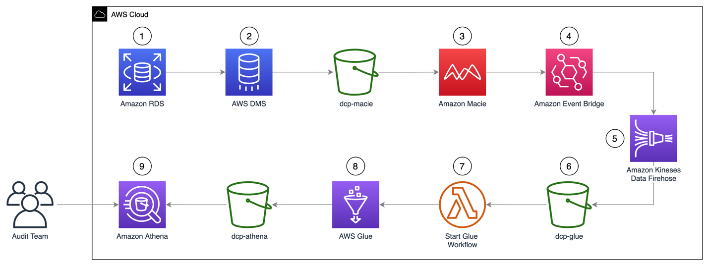

## Data Discovery and Classification of RDS Database in AWS

### Overview

Amazon Macie is a fully managed data security and data privacy service that uses machine learning and pattern matching to discover and protect your sensitive data in AWS.
Today it's only possible to run Amazon Macie Jobs against S3 buckets, so this solution will shows how to discover and classify relational database data from RDS using AWS Database Migration and also will use AWS Glue and Amazon Athena to simplify the audit assessments on Amazon Macie Jobs results.

## Deployment
Please refer to this [blog post](https://aws.amazon.com/blogs/security/enabling-data-classification-for-amazon-rds-database-with-amazon-macie/) for the detailed instructions on how to use the solution.

## Clean up
1. Delete the solution stack in the following order: **Disable Amazon Macie**.
2. Open the CloudFormation console at https://console.aws.amazon.com/cloudformation.
3. Select the Stack and click on **Delete** button.

After you finish, to clean up the solution and avoid unnecessary expenses, complete the following steps:

1. Go to the Amazon S3 console.
2. Navigate to each of the buckets listed below and delete all its objects:
    - dcp-assets
    - dcp-athena
    - dcp-glue
    - dcp-macie
3. Go to the CloudFormation console.
4. Select the **Stacks** option in the left menu.
5. Choose the stack you created in Step 1 – Deploying the CloudFormation template.
6. Select **Delete** and then select **Delete Stack** in the pop-up window.

## Reference links

https://docs.aws.amazon.com/macie/latest/userguide/macie-classify-objects-pii.html

https://docs.aws.amazon.com/macie/latest/APIReference/jobs.html 

https://docs.aws.amazon.com/macie/latest/user/custom-data-identifiers.html

## License summary
This sample code is made available under the MIT-0 license. See the LICENSE file.