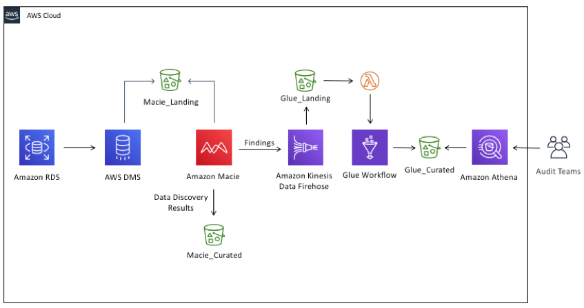
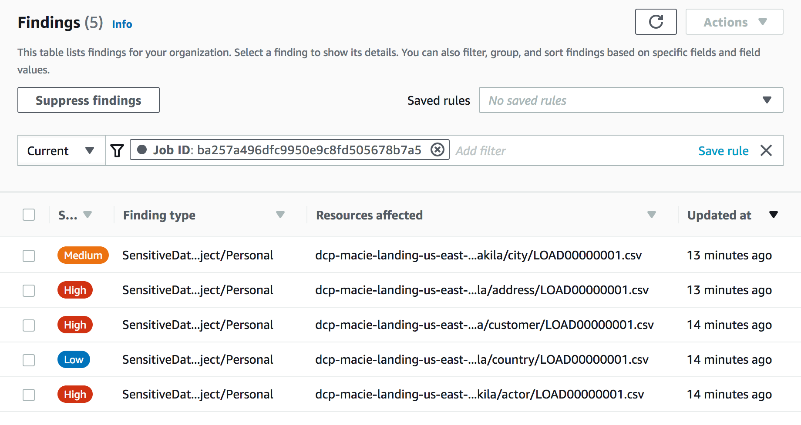
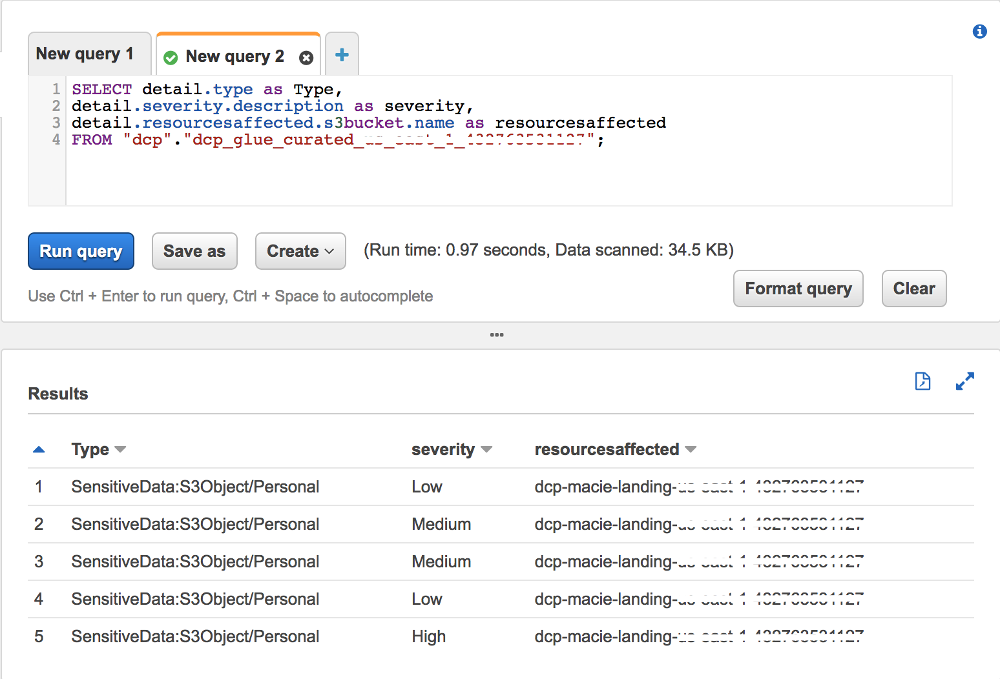

## Data Discovery and Classification of RDS Database in AWS

### Overview

Amazon Macie is a fully managed data security and data privacy service that uses machine learning and pattern matching to discover and protect your sensitive data in AWS.
Today it's only possible to run Amazon Macie Jobs against S3 buckets, so this solution will shows how to discover and classify relational database data from RDS using AWS Database Migration
and also will use AWS Glue and Amazon Athena to simplify the audit assessments on Amazon Macie Jobs results.



The architecture workflow contains the following steps:

1.	**Sakila** relational database on **RDS for MySQL**.
2.	**DMS task** that connect to **Sakila database** and transforms the data into several CSV files and load them into a **S3 bucket**.
3.	Once the DMS task has succeed, a **Macie classification job** will start to discover the data and put the results into another S3 bucket.
4.	Once the classification job are done, the Data Discovery Results will be delivered to an S3 Bucket and the **Macie Findings** to another S3 Bucket, using **Amazon Kinesis Data Firehose**. Once the findings are in the landing bucket, it will start an event that invokes a **Lambda Function** that starts a **Glue Workflow** and transform the JSON file into **Parquet** and deliver into the curated bucket.
5.	Once the ETL job has succeed, it’s time to run **SQL queries** using Amazon Athena.

To get started you will need an IAM user with the following access:

- Amazon Macie
- AWS CloudFormation
- AWS Cloud9
- Amazon RDS
- Amazon Athena
- Amazon S3
- Amazon Glue
- Amazon EC2
- Amazon Kinesis Data Firehose

_Note: Tested in the N. Virginia region (us-east-1)._


## Enable Amazon Macie
Your first step is to enable Amazon Macie.  Later we will create data classification jobs to investigate the contents of your S3 buckets and Macie will also do analysis on your S3 buckets and report on any configuration changes.

1. Go to the [Amazon Macie](https://console.aws.amazon.com/macie/home?region=us-east-1) console (us-east-1).
2. Click on the **Get Started** button.
3. Click on the **Enable Macie** button.  If not present then Macie is already enabled.
 
Macie is now enabled and has begun to collect information about the S3 buckets in the account.
  

## Deploying Cloud9 environment

1.	Open the [Cloud9](https://console.aws.amazon.com/cloud9/home?region=us-east-1) console (us-east-1). 
2.	On the Step 1 - Name environment: Enter an environment name (e.g RDS2MacieEnv).
3.	On the Step 2 - Configure settings: Just click on **Next** button.
4.	On the Step 3 - Review: Check the resources being created, and click on **Create Environment** button

## Deploying SAM template


1. Still in Cloud9 console, in **Your environments**, click in the **Open IDE** button on the envionment that was created (eg. RDS2MacieEnv).
2. Once your envionment was open, select the **bash** tab and execute the following commands:

```
git clone https://github.com/aws-samples/data-classification-pipeline.git
cd data-classification-pipeline/start-glue-job
npm install
cd ../
aws s3 mb s3://<SAM_BUCKET_NAME>
sam deploy –-stack-name <STACK-NAME> --capabilities CAPABILITY_NAMED_IAM --s3-bucket <SAM_BUCKET_NAME> --parameter-overrides DBPassword=<DB_PASSWORD>


```


## Running DMS Task

1. Open the [DMS](https://console.aws.amazon.com/dms/v2/home?region=us-east-1#dashboard) console (us-east-1).
2. In the DMS Dashboard, click on **Database migration tasks**.
3. You will see a task with name initiating with **rdstos3task-**. Select it.
4. Click on **Actions** and choose **Restart/Resume**.

_Note: when the task status turn to **Load complete**, it's time to check your output S3 bucket._ 

## Checking S3 Macie_Landing bucket

1. Open the [S3](https://console.aws.amazon.com/s3/home?region=us-east-1#).
2. Click in the bucket that contains **Macie_Landing** in the name.
3. Check if the bucket has this folder hierarchy:

```
sakila:
  actor
  address
  category
  city
  country
  customer

```
_Note: If is all ok, let's go to Amazon Macie._

## Configure Amazon Macie to export findings to an S3 Bucket

1. Go to the [Amazon Macie](https://console.aws.amazon.com/macie/home?region=us-east-1) console (us-east-1).
2. Click on [Settings](https://console.aws.amazon.com/macie/home?region=us-east-1#/settings) in the left hand menu.
3. Click on the **Configure Now** option under the section ***Respository for discovery results***.
4. Select the **Existing Bucket** option 
5. Using the dropdown called **Choose Bucket** select the bucket that has **macie_curated** in the name.
6. Under the KMS encryption section select the option **Select a key from your account** 
7. Using the KMS key alias dropdown select the KMS key that das **macie_curated** in the name.
8. Click **Save** to continue.  You should see a green banner indicating **Success**.  If you see a red banner with an error message, plese double check that you have selected the correct S3 bucket and KMS key.

## Create the Data Classification Job

1. Go to the [Macie console](https://console.aws.amazon.com/macie/home?region=us-east-1).
2. To begin, select the **S3 bucket** option in the left hand menu.
3. Select the S3 bucket with the output data from the DMS task.  You may need to wait a minute and then click ***Refresh icon*** if the bucket name do not display.
4. Click on the **Create job** button. 
> You are now able to verify the S3 bucket you chose before you continue, use the **Previous** or **Remove** buttons if you selected the incorrect S3 bucket.  
5. Click on **Next** to continue.
6. You will now scope your job. Create your job with the following parameters or scope.
- Schedule: One-time job  
- Sampling Depth: 100%  
- Leave all other settings as default 
7. Click on **Next** to continue.
> We will not be including any custom data identifiers in this job.
8. Click on **Next** to continue.
9. Give the job a name and description.  
10. Click on **Next** to continue.
11. Verify all the details of the job you have created and click on **Submit** to continue.
12. You will see a green banner telling you the ***The Job was successfully created***.

Once that your job has complete, you can select the check box of the job and click on **Show results** and select **Show findings** that will open the findings of the job.



_Note: You can navigate in the findings and click in the each checkbox and see the details._


## Exploring Macie Fidings using SQL with Amazon Athena

1.	Go to the [Athena console](https://console.aws.amazon.com/athena/home?region=us-east-1#query) and open the **Query editor**.
2.	It will show a message **Before you run your first query, you need to set up a query result location in Amazon S3. Learn more**. Click in the message link.
3.	In the **Settings** windows, put the address from the S3 bucket that you want to store the query results.
4.	Click in **Save**.
5.	Paste the content bellow into **Query Editor**:


```
SELECT detail.type as Type, detail.severity.description as severity, detail.resourcesaffected.s3bucket.name as resourcesaffected FROM "dcp"."dcp_glue_curated_[REGION]_[ACCOUNTID]";
  
```

6. Click on the **Run query** button.



_Note: Now you can start to run SQL query in your Macie Findings._

## Clean up
1. Delete the solution stack in the following order: **Disable Amazon Macie**.
2. Open the CloudFormation console at https://console.aws.amazon.com/cloudformation.
3. Select the Stack and click on **Delete** button.


## Reference links

https://docs.aws.amazon.com/macie/latest/userguide/macie-classify-objects-pii.html

https://docs.aws.amazon.com/macie/latest/APIReference/jobs.html 

https://docs.aws.amazon.com/macie/latest/user/custom-data-identifiers.html


## License summary
This sample code is made available under the MIT-0 license. See the LICENSE file.